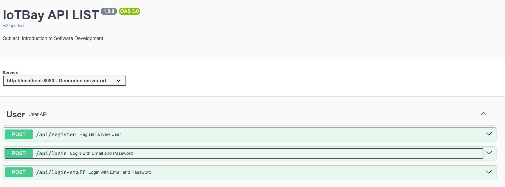

<br/>
<p align="center">
  <a href="https://github.com/wdh70743/IoTBay">
    
  </a>

  <h3 align="center">IotBay Project</h3>

  <p align="center">
    Java web application for managing and ordering IoT devices
    <br/>
    <br/>
    <a href="https://github.com/wdh70743/IoTBay"><strong>Explore the docs »</strong></a>
    <br/>
    <br/>
    <a href="https://github.com/wdh70743/IoTBay">View Demo</a>
    .
    <a href="https://github.com/wdh70743/IoTBay/issues">Report Bug</a>
    .
    <a href="https://github.com/wdh70743/IoTBay/issues">Request Feature</a>
  </p>
</p>

   

## Table Of Contents

* [About the Project](#about-the-project)
* [Getting Started](#getting-started)
  * [Prerequisites](#prerequisites)
  * [Installation](#installation)

## About The Project



## Project Description

IoTBay seeks to transition from an old desktop-based in-store application to a modern, online platform to keep up with the rapidly increasing demand for IoT devices. The project encompasses building a web application that facilitates device collection management, order processing, payment processing, and delivery, along with user registration, login, and logout capabilities.

### Objectives

1. **Improve Devices Inventory Management**: Enhancing the sale and restocking process for an extensive range of IoT devices.
2. **Enhance Customer Experience**: Streamlining accounts, purchases, payments, and shipments to offer a seamless online shopping experience.
3. **Boost Online Sales**: Utilizing online search and ordering capabilities to increase sales and expand the customer base.
4. **Optimize Staff Management Experience**: Improving the management of accounts, database, and inventory through a user-friendly backend.

### Scope

The application targets both IoTBay staff and customers, offering:

- Registration and login using email and password.
- Device collection management, order tracking, and user management for staff.
- Browsing, searching, ordering, order tracking, and account management for customers.
- Anonymous user access for browsing, searching, purchasing, and tracking orders.

## Getting Started

This is an example of how you may give instructions on setting up your project locally.
To get a local copy up and running follow these simple example steps.

### Prerequisites

Before setting up the IoTBay application, ensure your system meets the following requirements:

- **Java Development Kit (JDK)**: Version 21 is required to run the application. You can download it from [Oracle's official site](https://www.oracle.com/java/technologies/javase/jdk21-archive-downloads.html) or use OpenJDK.
- **Maven**: Version 3.x or above. Maven is used for project dependency management and building the project. Download and installation instructions can be found on the [Apache Maven Project website](https://maven.apache.org/).
- **PostgreSQL**: The application uses PostgreSQL as the primary data storage solution. Ensure PostgreSQL is installed and running on your system. Instructions can be found on the [PostgreSQL official website](https://www.postgresql.org/download/).
- **Spring Boot**: The project is built with Spring Boot version 3.2.3, but you don't need to install Spring Boot separately since Maven will handle the Spring Boot dependencies.

### Installation

Once you have the prerequisites in place, follow these steps to get the IoTBay application running:

1. **Clone the Repository**: 
- Clone the IoTBay project repository to your local machine using Git:
  
  ```
  git clone https://github.com/wdh70743/IoTBay
  ```
  
2. **Database Setup**:
- Update the `spring.datasource.url`, `spring.datasource.username`, and `spring.datasource.password` properties in the `application.properties` file with your PostgreSQL details. If you followed the command above, your URL is likely correct, but ensure the username and password match your PostgreSQL credentials.


3. **Build the Project**:
- Open a terminal or command prompt and navigate to the root directory of the IoTBay project you cloned.
- Run the following Maven command to build the project and install dependencies:

  ```
  mvn clean install
  ```

4. **Run the Application**:
- After the build completes successfully, start the Spring Boot application by running:

  ```
  mvn spring-boot:run
  ```

- The application will start running on `http://localhost:8080`.

5. **Accessing the Swagger UI**:
- With the application running, you can access the Swagger UI to interact with the API by visiting `http://localhost:8080/api-list`.

By completing these steps, you should have the IoTBay application up and running on your local machine. You can now explore its features and functionalities through Swagger UI.
